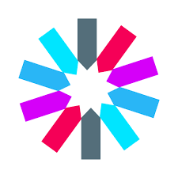
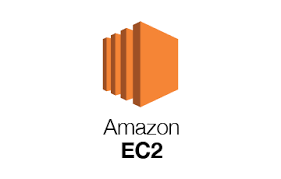

<div align="center">

<!-- logo -->


### CashWalk Flutter App 🏃

[]() []() []() <br/> []()

</div>

---

## 📝 소개

Flutter 기반으로 제작된 CashWalk 클론 앱입니다. 걷기 활동 기반 포인트 적립, 러닝 기록, 실시간 채팅, 커뮤니티 등 다양한 기능을 제공하는 건강 리워드 플랫폼입니다.

* 사용자 걸음수 트래킹 및 포인트 적립
* 러닝/걷기 기록 및 요약 시각화
* 친구 추가 및 STOMP 채팅
* 공원 산책 리워드 기능
* 게시판, 댓글, 좋아요 등 커뮤니티 기능 내장

---

### 📱 화면 구성

|                                                            홈/걸음수/보상                                                            |
| :----------------------------------------------------------------------------------------------------------------------------: |
|  |
|                                               걸음 수와 포인트 적립 현황을 애니메이션과 함께 시각화합니다.                                               |

|                                                            채팅/러닝 기록                                                            |
| :----------------------------------------------------------------------------------------------------------------------------: |
|  |
|                                                친구와 채팅, 러닝 결과 확인, 다이어리 작성이 가능합니다.                                               |

---

## ⚙ 기술 스택

> skills 폴더에 있는 아이콘을 이용할 수 있습니다.

### Front-end

<div>



</div>

### Infra

<div>


</div>

### Tools

<div>

</div>

---

## 🛠 주요 디렉토리 구조

```
lib/
├── main.dart                # 앱 실행 시작점
├── page/                    # 홈, 러닝, 커뮤니티 등 주요 탭
├── screen/                 # UI 위젯 및 상세 화면
├── services/               # API 호출 클래스
├── models/                 # 데이터 모델 클래스
├── utils/                  # 유틸리티 함수 (토큰 저장 등)
├── widgets/                # 공통 재사용 위젯
└── firebase/               # FCM 관련 설정
```

---

## 🤔 기술적 이슈와 해결 과정

* **STOMP 실시간 채팅 구현**

  * 웹소켓 연결 후 JWT 인증 처리
  * \[JwtHandshakeInterceptor + Kakao User 연동 문제 해결]
* **걸음수 애니메이션 반영 딜레이 해결**

  * Duration + Lottie 조합 타이밍 최적화
* **기기 재실행 시 누락된 데이터 복원**

  * SharedPreferences 통한 캐싱 구현


